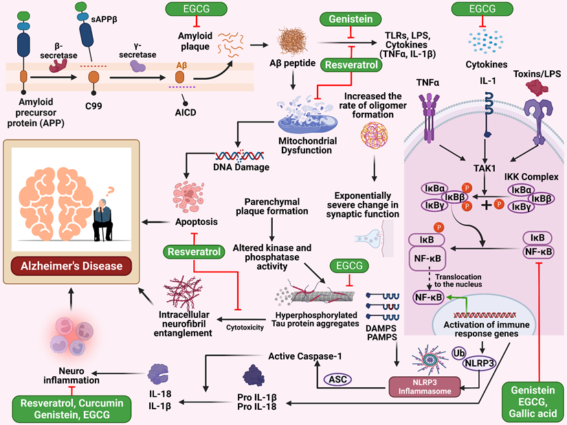

**El artículo destaca la importancia de los polifenoles como potenciales agentes
neuroterapéuticos, enfatizando específicamente su impacto en la vía del factor de
transcripción nuclear kappa B (NF-κB).**

---

## Introducción
Las enfermedades neurológicas son un grupo de afecciones que afectan el sistema nervioso
central y periférico, y pueden tener un impacto significativo en la calidad de vida de
las personas que las padecen. La prevención y el tratamiento de
estas son fundamentales para mejorar la salud y reducir la
carga de enfermedad en la sociedad.
En este sentido, los polifenoles han demostrado tener un poderoso efecto 
protector en la salud neurológica. Los polifenoles son moléculas complejas que
se encuentran en una variedad de alimentos, como frutas, verduras, cereales y bebidas.
Estos compuestos tienen propiedades antioxidantes y antiinflamatorias, lo que los
convierte en una herramienta valiosa para prevenir y tratar enfermedades neurológicas. 
En este artículo publicado en la revista **International Journal of Biological Sciences** 
por *Abdullah Al Mamun y colaboradores* destacaremos la importancia de los polifenoles
como potenciales agentes neuroterapéuticos, enfatizando específicamente su impacto
en la vía del **factor de transcripción nuclear kappa B (NF-κB)**.

## Investigación
Este artículo destaca el potencial de los compuestos polifenólicos como candidatos
para tratar diversas enfermedades neurológicas, como el Alzheimer, Parkinson, la
isquemia cerebral, los trastornos de ansiedad, la depresión y el daño de la medula espinal.
Los compuestos polifenólicos tienen la capacidad de interferir con la ruta de
señalización NF-κB, lo que puede ayudar a prevenir la progresión de estas enfermedades.
Los polifenoles han mostrado propiedades neuroprotectoras prometedoras y se ha descubierto
que alteran la vía NF-κB al inhibir la fosforilación o ubiquitinación de moléculas de
señalización.

## Conclusiones
La investigación ha demostrado que los compuestos polifenólicos como la curcumina,
el resveratrol y el pteroestilbeno tienen efectos inhibidores en la ruta de NF-κB,
lo que los convierte en candidatos prometedores para el tratamiento de enfermedades
neurológicas. 
Además, estos compuestos tienen una amplia gama de propiedades farmacológicas,
lo que los hace útiles para tratar una variedad de patologías del sistema nervioso.

---

## Referencias
Mamun AA, Shao C, Geng P, Wang S, Xiao J. Polyphenols Targeting NF-κB Pathway in
Neurological Disorders: What We Know So Far?. Int J Biol Sci. 2024;20(4):1332-1355.
Published 2024 Jan 27.
<a href="https://www.ijbs.com/v20p1332.htm" target="no_blank">Ir.</a>